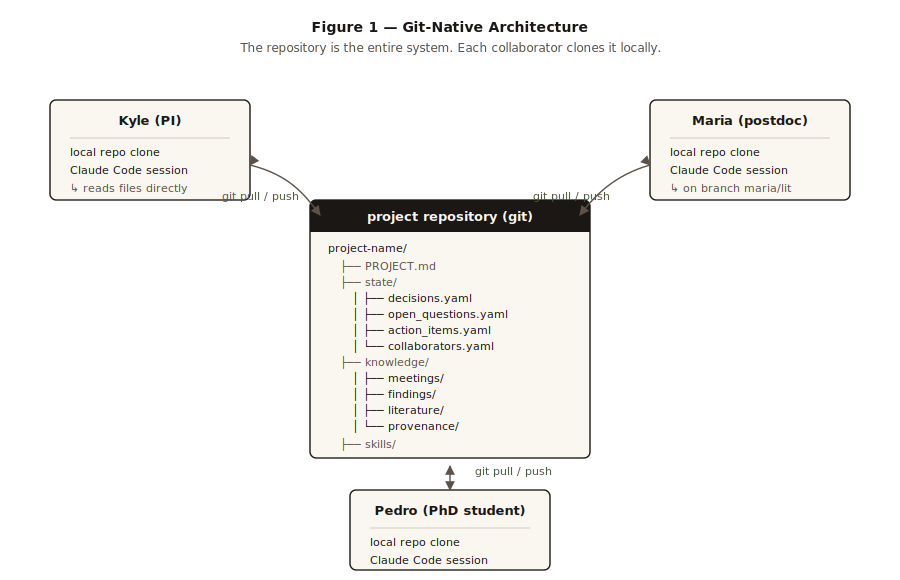
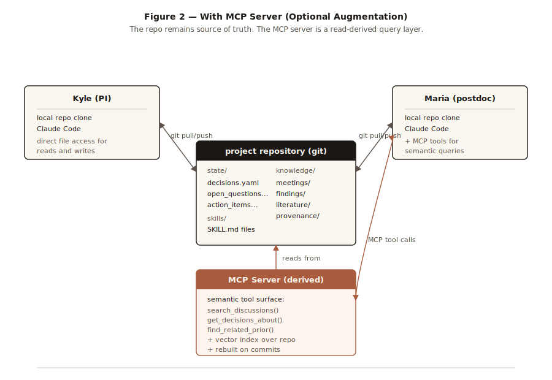
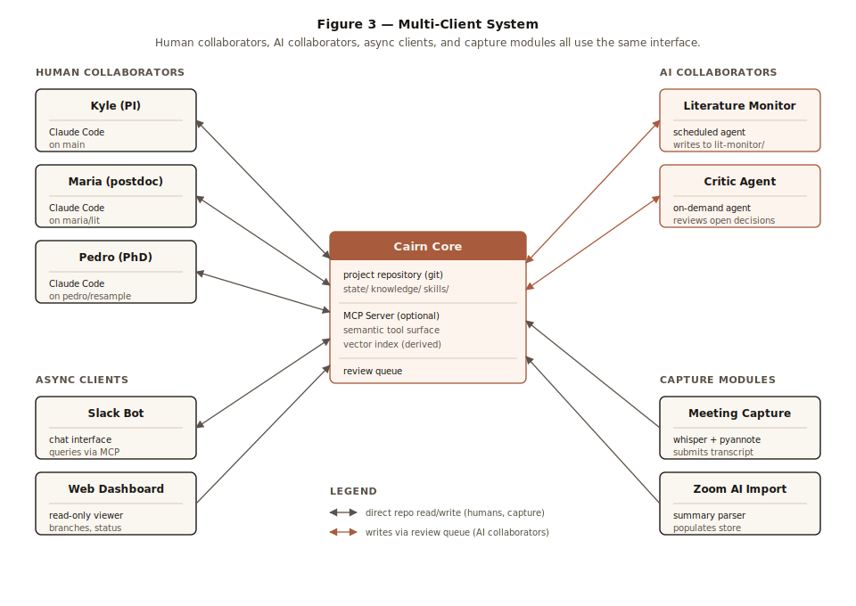
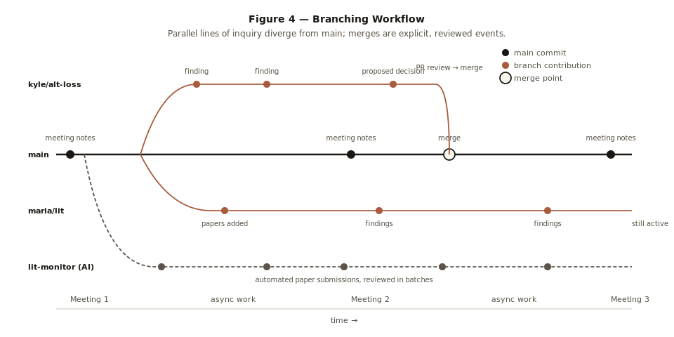

# Cairn

*An agent-native framework for distributed research collaboration*

---

## Overview

Cairn is a tool and design standard for hybrid human/AI research collaboration. It defines a repository structure, file schemas, exploration conventions, and patterns for treating human and AI contributors uniformly. Around these conventions, Cairn provides a Python package for scaffolding and managing project instances, plus reference patterns for layered augmentations like MCP servers, meeting capture, and AI collaborators.

A research project using Cairn is concretely a git repository organized following these conventions — *a cairn*. There is one cairn per project; the framework lives in the patterns and tooling, not in any centralized service.

The name comes from the stone markers travelers build along trails: each contributor adds to the pile, the marker persists for those who follow, and the structure is visible at a distance without depending on any one builder.

## Motivation

Research groups would benefit from a shared collaborator that:

- Maintains persistent memory of meetings, decisions, and discussions
- Lets group members query the project's history asynchronously ("was X considered?", "what did we decide about Y?")
- Generates ideas, suggests connections, and helps prepare for upcoming meetings
- Tracks deadlines, goals, action items, and project state
- Onboards new members without requiring senior members to repeat themselves
- Surfaces cross-pollination across multiple projects

Existing tools cover individual pieces (meeting transcription, knowledge bases, agent memory) but no integrated solution targets the academic research-group use case with local-first, inspectable design. Cairn is intended to fill that gap.

## Architectural Principles

### 1. Augmentation, not replacement

Cairn does not redirect how collaborators work. They keep using their normal tools — git, Zoom, Slack, email, paper, conversation — at their normal rhythm. An agent listens in those native channels and writes structured notes into the cairn as a side effect. The agent's role is *facilitator, not stenographer*: it may ask focused clarifying questions in service of accurate capture, but never proposes new rituals, session-switching, or workflows the user wouldn't have done anyway. The test, when designing any feature: would a thoughtful new collaborator joining the project naturally be doing this same thing? See `docs/decisions/0007-augmentation-not-replacement.md`.

### 2. The repository is the source of truth

All canonical project state lives in a git repository. Every other component — agents, indices, MCP servers, dashboards, automations — is a derived view or interface layer that reads from and proposes writes to the repo. No component owns state that isn't reflected in the repo.

### 3. Derived systems are disposable

Because the repo holds truth, any derived system can be rebuilt or replaced without compromising the substrate. Vector indices can be regenerated. MCP servers can be swapped. Agent frameworks can change. The project survives them all.

### 4. Uniform collaborator abstraction

Human and AI collaborators interact with the system through the same interfaces (git operations, optionally MCP tool calls). Identity differs; mechanism does not. This makes adding new kinds of contributors (a critique agent, a literature monitor, a guest collaborator) a configuration change rather than an architectural one.

### 5. Explorations as first-class (optional)

Parallel exploration is *supported* via cairn explorations — a tracked alternative line of inquiry materialized as a git branch in the cairn repo, with an `explorations/<name>.md` manifest recording rationale, and an explicit merge moment that becomes both a review opportunity and a durable artifact. Explorations are an optional augmentation, not a required workflow step: a user who tracks every parallel line of inquiry via project-repo git branches and never creates a cairn exploration is using Cairn correctly. The concept (and the `cairn exploration` CLI) exists for cases where the rationale itself is the artifact worth preserving — typically design alternatives, methodology choices, or branching investigations whose comparison matters beyond their individual results. See `docs/decisions/0008-client-server-and-exploration-rename.md`.

### 6. Layered consumption matches layered distribution

Different kinds of context warrant different distribution mechanisms:
- **Skills** (procedural knowledge): replicated locally via git, read from disk
- **Knowledge base** (large, content-addressed): queried via tools or read from files
- **Agent memory** (small, frequently updated state): queried via tools or read directly from YAML

## System Architecture

### Git-Native Configuration (Starting Point)



In its simplest configuration, a cairn is just a git repository — a directory tree following Cairn's conventions, with no additional services required. Each collaborator clones it. Their Claude Code session has access to the repo on disk. To orient itself, the session reads `PROJECT.md` (a small file that points to where things live and summarizes current project state). To answer questions, it reads files directly: meeting transcripts, decisions, findings, literature notes. To contribute, it edits files and commits, with the commit author providing attribution.

This is sufficient for most small research groups for a surprisingly long time. Reads through filesystem access are fast and free. Writes are normal git operations that the team already knows how to use. Permissions, history, and review all come from GitHub. No services to run, nothing to maintain, nothing to break.

### MCP-Augmented Configuration



When the project grows past what direct file access handles well — when there's a year of meeting notes to search, or when queries like "find prior discussions related to this new finding" start being slow as plain reads — add an MCP server alongside the repo. The MCP server reads from the repo (it does not own state), maintains a derived vector index for semantic search, and exposes a curated set of semantic tools to client agents. Tools are named for the lab's actual ways of slicing the project ("get_decisions_about", "find_related_prior_discussion", "summarize_exploration") rather than as a generic search interface, so the calling agent knows when to use each.

Critically, this is purely additive. The repo remains the source of truth. The MCP server can be added later, replaced later, or removed entirely without altering the substrate. Collaborators can use it or not on a per-session basis.

### Multi-Client System



Once the core is established, many kinds of clients can interact with it through the same interface:

- **Human collaborators** with Claude Code sessions, each pointed at the repo and optionally the MCP server
- **AI collaborators** (literature monitor, critique agent, etc.) running as scheduled or on-demand processes, submitting contributions through a review queue
- **Async clients** like a Slack bot for chat-based queries, or a web dashboard for visualization
- **Capture modules** that ingest meetings (live transcription + diarization, or imports of Zoom AI summaries) and submit structured contributions

The architecture is intentionally agnostic about which clients exist. New ones are added by writing modules that read from and write to the repo (or call MCP tools); the rest of the system doesn't need to change.

## Repository Structure

A cairn is a standalone git repository, **separate from the project's code/data/paper repos**. A typical research project already has one or more such "working" repos; the cairn is an additional repo that holds the coordination layer — decisions, open questions, findings, action items, meeting notes — that doesn't fit naturally inside any working repo. The cairn references the working repos (initially via free-form notes in `PROJECT.md`'s "Related repositories" section; structured cross-references — e.g., linking a finding to a specific commit SHA in a code repo — are future work). One project = one cairn = one git repo, but a project may have several code/data repos that the cairn coordinates.

The separate-repo design has an immediate consequence for how an agent interacts with a cairn. In v0 there are two distinct *access modes*:

- **Mode A** — the user's Claude Code session is open inside the cairn directory. The bundled SessionStart hook, the skills at `skills/<name>/SKILL.md`, and the tracking-stance posture in `TRACKING.md` are all in the agent's context automatically. This is the supported mode for cairn work (planning, debriefing, recording, reviewing).
- **Mode B** — the session is open inside a project's working repo, and the cairn lives elsewhere on disk. The agent there has no automatic awareness of the cairn. Bridging is manual for v0 (the user runs the *debrief* skill in a separate cairn session at the end of a working block); a cleaner Mode B implementation (globally-installed cairn skills with cairn-discovery) is planned but deferred. See `docs/decisions/0005-cross-repo-skills.md`.

```
project-name/
  README.md                 # human-facing project overview
  PROJECT.md                # agent orientation file
  state/
    decisions.yaml          # canonical decisions, with timestamps and authors
    open_questions.yaml     # active questions the group is working on
    action_items.yaml       # current assignments and deadlines
    goals.yaml              # project goals and milestones
    collaborators.yaml      # people on the project, roles, expertise
  knowledge/
    meetings/
      2026-05-12.md         # one file per meeting, speaker-attributed
      ...
    findings/               # logged findings from collaborators
    literature/             # papers, with notes
    provenance/             # reproducibility & AI-usage artifacts (RO-Crates, model cards, etc.)
  skills/
    lit-review/SKILL.md
    methods-section/SKILL.md
    ...
  explorations/
    README.md               # human-readable index of active explorations
```

Git branches do the actual branching of files; the `explorations/` directory is just an index (plus a per-exploration manifest) summarizing what each active line of inquiry is about, kept on main for visibility.

## State Schemas

State files use YAML with a small, stable schema. Both humans and agents read and write them. Examples:

```yaml
# state/decisions.yaml
- id: D-014
  date: 2026-04-22
  author: kyle
  decision: Use stratified resampling for the imbalanced classes
  context: Discussed in meeting 2026-04-22; alternative was SMOTE
  supersedes: null
  related: [Q-007]

# state/open_questions.yaml
- id: Q-012
  raised_by: maria
  date: 2026-05-08
  question: Does the bias correction introduce identifiability problems
  status: open
  related: [D-014]
```

The schemas are deliberately simple. Validators and helpers belong in a future Python package; they don't need to exist in the first version.

## Provenance Artifacts

The `knowledge/provenance/` directory stores artifacts that document the provenance of the project's outputs — particularly important when AI agents have contributed to findings. Several standards exist for this purpose, and the space is rapidly evolving. Cairn does not prescribe one; it provides a consistent location for whichever standards a project chooses to use, and expects that choice to shift over time.

Among the standards and conventions currently emerging or competing in this space:

- **[ASTRA (Agentic Schema for Transparent Research and Analysis)](https://astra-spec.org)** — Lanusse & Parker, 2026, *Science that Compounds: The Need for A New Substrate for Research in the Age of AI* (Lightcone Research). An open specification under active development for the scientific record itself. ASTRA articulates three properties an analysis must satisfy to be efficiently vetted by humans or machines: *provenance-certified* (every plot, number, and claim ties back to the data, code, and decisions that produced it), *fully observable* (every consequential decision — estimator, prior, cutoff, dataset, preprocessing — and the reasoning behind it is inspectable), and *scientifically legible* (the analysis is reorganized around the claims and decisions that matter, with paths into supporting evidence). Like Cairn, ASTRA commits to being a specification rather than a platform — the substrate should outlast any particular generation of tooling.
- **[ARA (Agent-Native Research Artifact)](https://github.com/Orchestra-Research/Agent-Native-Research-Artifact)** — Liu et al., 2026. A structured layout that organizes a research output into interlocking layers (logic, source code, exploration trace, evidence) with cross-layer bindings between claims, code, and supporting data. Notably preserves dead-end nodes in an exploration graph and uses provenance tags (`user`, `ai-suggested`, `ai-executed`, `user-revised`) to distinguish human-confirmed facts from AI inferences. Designed explicitly for AI agent consumption; ships with Claude Code skills for compilation, live capture, and review.
- **[PROV-AGENT](https://arxiv.org/abs/2508.02866)** — Souza et al., 2025. Extends W3C PROV to capture fine-grained agent interactions — prompts, responses, tool calls, model invocations — and integrate them with broader workflow provenance graphs. Particularly relevant when one agent's output feeds another's input and errors can propagate; designed to make agent reasoning traceable across federated environments.
- **[RO-Crate](https://www.researchobject.org/ro-crate/)** — JSON-LD packaging of research artifacts using Schema.org annotations. Widely supported in scientific tooling ecosystems and FAIR data initiatives.
- **[W3C PROV](https://www.w3.org/TR/prov-overview/)** — general-purpose provenance vocabulary, foundational for several of the others.
- **Workflow systems** ([Snakemake](https://snakemake.readthedocs.io/), [Nextflow](https://nextflow.io/), [Galaxy](https://galaxyproject.org/), [WorkflowHub](https://workflowhub.eu/), CERN's [REANA](https://reana.io/)) and **computational environment records** (Docker, pixi, conda lock files) — long-established in fields like bioinformatics and experimental particle physics.
- **Model cards, dataset cards, AI usage disclosures** — narrower formats addressing specific reporting requirements that journals, conferences, and funders are beginning to require.

The relationship to neighboring folders: `findings/` records what the group has learned; `provenance/` records the audit trail behind those findings — how they were arrived at, what data and methods were used, which agents contributed, and how to reproduce them.

There is a natural complementarity between Cairn and these standards. Cairn captures the *living* state of a project — meetings, decisions, explorations, day-to-day work, the messy accretion of a group's reasoning over time. Standards like ASTRA and ARA capture *crystallized* records of specific results, structured for vetting and external review. Both rest on the same foundational commitment: the substrate should be a specification, not a platform, so that an ecosystem of tools can grow around it. Specific points of resonance: ARA's exploration graph corresponds to Cairn's explorations and decisions; ARA's provenance tags echo Cairn's collaborator attribution; ASTRA's three properties (provenance-certification, observability, legibility) are properties Cairn aspires to in its own working state, even as Cairn's scope (the living project) differs from ASTRA's (a vetted analysis). The `cairn` Python package may eventually grow utilities for exporting parts of a cairn into ASTRA, ARA, RO-Crate, or similar formats.

Because the standards in this space are competing and evolving, the internal structure of `provenance/` is intentionally unspecified. Each output can carry whatever artifact format best fits the venue's norms at the time. The convention is only that the artifacts live here, alongside the findings they substantiate.

## Explorations Workflow



An **exploration** is a tracked alternative line of project inquiry — a parallel investigation, methodology choice, or design alternative whose rationale is worth preserving alongside the result. Anyone can start one. An exploration's contents are proposed additions or revisions to project state — new findings, alternative decisions, exploratory analyses — diverging from `main` while the shared knowledge base (meeting notes, prior findings) remains visible across all explorations.

Under the hood, an exploration is a git branch in the cairn repo plus an `explorations/<name>.md` manifest recording why it exists. Cairn deliberately uses a different word, though: in a session opened inside a project's *code* repository, "let's create a branch" almost always means a git branch in that project codebase, and overloading the same term for a cairn-level tracking concept caused real confusion in early UX testing. The user's existing meaning wins; the cairn concept gets a different word. See [ADR-0008](docs/decisions/0008-client-server-and-exploration-rename.md) for the full rationale.

Closing an exploration happens via pull request. For pure additions (new findings, new references) the merge can be routine. For overrides (an exploration proposes revising a decision on main) the merge needs review — ideally surfacing on a meeting agenda where the group discusses what to accept. The merge proposal becomes an artifact in its own right, recording how the group reasoned through alternatives.

Explorations don't need to merge to be valuable. One that didn't pan out is itself useful project history — a record of what was tried and why it was set aside.

## Collaborators

Each person (and each AI) has an entry in `state/collaborators.yaml`:

```yaml
- id: maria
  name: Maria Santos
  role: postdoc
  github: msantos
  expertise: [causal inference, longitudinal data, R]
  current_focus: bias correction methods
  recent_papers: [10.1234/foo, 10.5678/bar]
  notes: Tends to surface measurement-error concerns early

- id: lit-monitor
  type: ai-collaborator
  role: literature monitor
  trigger: weekly
  scope: arxiv stat.ML, stat.ME
  permissions: write to lit-monitor/* branches only
```

The collaborators file is what the agent reads to understand who it's talking to and how to attribute contributions. Each collaborator can (and should) edit their own entry.

## Meeting Capture Module

The meeting capture module is a separable component. It produces speaker-attributed transcripts and submits them to the cairn — either as commits to the repository or as submissions via an MCP server if one is running. The module's interface is the schema of what it submits; its internal mechanics (which transcription engine, which diarization approach, whether it joins meetings live or processes recordings) can vary.

Recommended starting stack for local operation on Apple Silicon: streaming Whisper (mlx-whisper or whisper.cpp) for live transcription with VAD-based chunking, plus pyannote-audio in batch for post-meeting speaker diarization. Transcripts are aligned with diarization by timestamp and written as markdown files to `knowledge/meetings/`. Voice identification across meetings emerges from accumulated voice samples per collaborator.

A simpler initial path: import Zoom AI Companion summaries by hand or via a small parsing script that drops them into `knowledge/meetings/` in the standard format.

## AI Collaborators

AI collaborators are first-class participants. Each has an identity in `state/collaborators.yaml`, writes to its own dedicated explorations, and submits contributions through a review queue rather than directly to main. Examples worth building:

- **Literature monitor**: watches arXiv categories relevant to the project, submits findings to a dedicated exploration on a weekly schedule
- **Critic agent**: on demand, reviews open decisions and surfaces potential weaknesses or unconsidered alternatives
- **Reproducibility checker**: periodically re-runs key experiments from the codebase snapshot, flags drift
- **Idea generator**: given current open questions, generates candidate approaches as exploration proposals

The natural starting point is the literature monitor: high value, low risk, easy to evaluate, and gives the group experience with AI contributions in a contained way before adding more.

## Multi-Project Considerations

A research group typically runs several projects, and ideas flow between them. Cairn's pattern is one cairn per project: collaborators working on multiple projects clone multiple repos. Their Claude Code session, when working on project A, can be pointed at project B's cairn as additional context — enabling queries like "is anything from my other project relevant here?" Cross-project capability falls out of the architecture without requiring new infrastructure.

A "personal" meta-repo per collaborator, listing the projects they're on as submodules or paths, makes it easy to point one Claude Code session at everything they care about.

## Build Path

The phasing below tracks the actual execution plan. (An earlier draft of this section used different phase numbers — `Phase 0 = discovery`, `Phase 1 = template`, `Phase 2 = Python package` — borrowed from the original time-budgeted plan. The current numbering, also reflected in `README.md` and `CLAUDE.md`, re-groups them by what gets shipped together.)

### Phase 0 — Foundation *(done)*
Canonical cairn template at `templates/default/`, Pydantic v2 schemas for the five state files, and the CLI commands `cairn init`, `cairn collaborator add`, `cairn decision add`, `cairn validate`, `cairn status`. Covers user stories US-P-01 through US-P-06. The Python package is the canonical tooling for creating and working with cairns; cookiecutter-style templates remain supported via `cairn init --template <path-or-url>`.

### Phase 1 — Agent skills + supporting commands *(current)*
Make a cairn useful inside a Claude Code session by bundling `SKILL.md` files in `templates/default/skills/` (the standard Claude Code skill format), and add the small set of CLI primitives those skills need. Target stories: US-A-01 (orient at session start), US-A-03 (create an exploration — requires `cairn exploration start`), US-A-04 (mark an action item complete — requires `cairn action add` and `cairn action complete`), US-A-05 (search prior discussions). Skills land at the framework level and ship into new cairns through `cairn init`.

### Phase 2 — Python package extensions
Meeting import (US-P-07), artifact export to ASTRA / ARA / RO-Crate (US-P-08), and agenda draft (US-P-09). Also other small helpers as patterns settle.

### Phase 3 — MCP server
Add a centralized MCP server that reads from the repo, maintains a vector index, and exposes semantic tools. Now Claude Code sessions can call into it from anywhere.

### Phase 4 — Meeting automation
Add the meeting capture module: streaming Whisper, pyannote diarization, automated commits to `knowledge/meetings/`.

### Phase 5 — AI collaborators
Add the first AI collaborator (literature monitor). Evaluate. Add more as warranted. Requires the scheduling and permissions runtime that enforces what AI collaborators declared in `state/collaborators.yaml` are allowed to write.

### Phase 6 — Interactive voice mode (long-term)
Voice-mode AI participant in meetings, using the same Cairn interface as everything else.

## Design Decisions

A few decisions worth recording for future reference:

**Why git, not a database.** Git already provides versioning, branching, merging, attribution, distributed access, conflict detection, review workflows, and offline capability. Building these on top of a database would be reinventing what already exists, worse. The only reason to use a database is if you have requirements git can't meet, and a research group's project memory doesn't.

**Why YAML, not JSON.** YAML is human-editable. Researchers will sometimes want to edit state files by hand, and YAML's syntax is friendlier for that. JSON would be marginally better for tooling but worse for the primary use case.

**Why MCP is optional, not foundational.** MCP is a useful augmentation but a research group with a year of project history can run entirely on git-based access. Making MCP optional preserves the survivability of the system: if the MCP ecosystem changes or the server breaks, the project continues working.

**Why one agent identity per AI collaborator, not "Claude" generically.** Distinct identities let the group evaluate AI contributions on their own terms, attribute work to specific automated processes, and configure permissions per-agent. It also matches the uniform-collaborator principle: AI collaborators are participants, not invocations of a generic tool.

**Why a review queue for AI writes.** AI contributions can be valuable and can also be noise. A review queue creates a deliberate moment where humans evaluate what to promote, which both protects canonical state and provides feedback signal for tuning AI collaborators over time.

## Open Questions

A few things to figure out as the system grows:

- What's the right cadence for the literature monitor to surface findings without overwhelming the group?
- How should explorations that go dormant be archived without losing their record?
- What permissions model handles the realistic case of guest collaborators (visiting students, external co-authors)?
- For multi-project use, how should skills and AI collaborators be shared across projects vs. scoped to one?

These don't need answers up front. They're things to revisit as the system is used.
